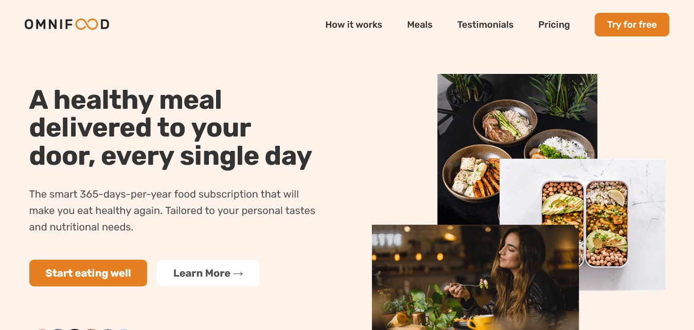
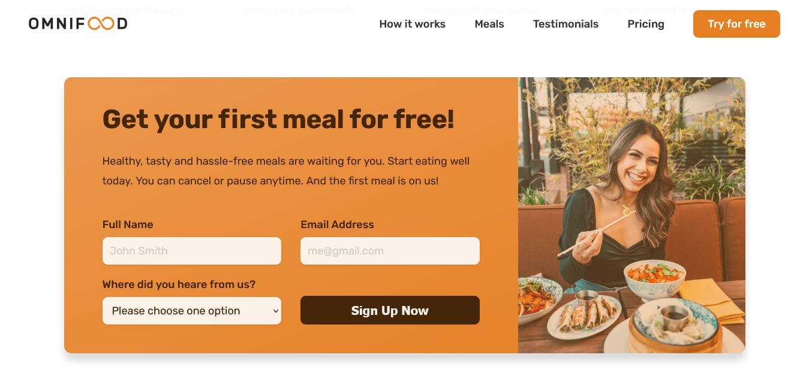

## ⭐ Omnifood-Never Cook Again ⭐

A Food Delivery AI Startup's **Fully Responsive** website, built using **HTML5, CSS3, and JavaScript.**
 

## 📌 **Live Site URL:** <a href="https://omnifood-to-cook.netlify.app/" target="_blank">**Visit Now** 🚀</a>

## 📌 Tech Stack

&nbsp;
&nbsp;

 

## Output:

## 📌 My process

- I started Udemy Course "Build Responsive Real-World Websites with HTML and CSS" by Jonas Schmedtmann.<a href="https://www.udemy.com/course/design-and-develop-a-killer-website-with-html5-and-css3/" target="_blank"> **Check🚀 (Not Sponsered)**</a>
- I feel confident while writing CSS 👊.
- This project has given me the confidence to build any complex layouts 👊.
- Still, we all know that learning CSS is a never-ending process 🚫.

## 📌 What I Learn

👉 Web design principles.  
👉 How to optimize the website for production.  
👉 How to design a website from scratch.  
👉 Responsive Design.

## 📬 Connect With Me

- **LinkedIn** - [Rushikesh Gandhmal](https://www.linkedin.com/in/rushikesh-gandhmal/)
- **Twitter** - [@rushikesh1s](https://twitter.com/rushikesh1s)

## 📌 Acknowledgments

- This ReadMe File Inspired From - [Jigar Sable](https://github.com/jigar-sable)
- Course Instructor - [Jonas Schmedtmann](https://codingheroes.io/)
- Icons Used For Tech Stack Section - [https://img.shields.io](https://img.shields.io)
